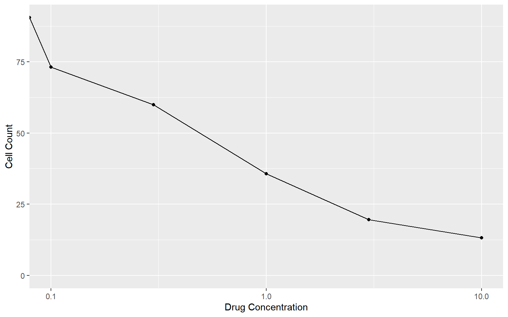

<details class="code-fold">
<summary>Code</summary>

``` r
library(magrittr)
library(ggplot2)
```

</details>
<details class="code-fold">
<summary>Code</summary>

``` r
# https://rpubs.com/russH/378543
dose_response <- structure(list(conc = c(0, 0.1, 0.3, 1, 3, 10), cell_count = c(90.4476560412627, 
  73.0426031727349, 59.8677345071323, 35.684936411427, 19.654121359138, 
  13.2675099068359)), class = "data.frame", row.names = c(NA, -6L
  ))

p <- ggplot(
  data = dose_response, aes(x = conc, y = cell_count)
) +
  geom_point() +
  geom_line() +
  labs(x = "Drug Concentration", y = "Cell Count") +
  ylim(0, NA)

p
```

</details>


<details class="code-fold">
<summary>Code</summary>

``` r
p + scale_x_continuous(trans = "log10")
```

</details>

    Warning in scale_x_continuous(trans = "log10"): log-10 transformation introduced infinite values.
    log-10 transformation introduced infinite values.



<details class="code-fold">
<summary>Code</summary>

``` r
## Fitting data to the EC50 equation

library(drc)
```

</details>

    载入需要的程序包：MASS


    'drc' has been loaded.

    Please cite R and 'drc' if used for a publication,

    for references type 'citation()' and 'citation('drc')'.


    载入程序包：'drc'

    The following objects are masked from 'package:stats':

        gaussian, getInitial

<details class="code-fold">
<summary>Code</summary>

``` r
curved_fit <- drm(
  formula = cell_count ~ conc,
  data = dose_response,
  fct = LL.4(names = c("hill", "min_value", "max_value", "ec_50"))
)
summary(curved_fit)
```

</details>


    Model fitted: Log-logistic (ED50 as parameter) (4 parms)

    Parameter estimates:

                           Estimate Std. Error t-value   p-value    
    hill:(Intercept)       0.920147   0.100768  9.1313 0.0117816 *  
    min_value:(Intercept)  7.576082   3.312091  2.2874 0.1494360    
    max_value:(Intercept) 89.985959   1.960841 45.8915 0.0004745 ***
    ec_50:(Intercept)      0.496227   0.068979  7.1939 0.0187801 *  
    ---
    Signif. codes:  0 '***' 0.001 '**' 0.01 '*' 0.05 '.' 0.1 ' ' 1

    Residual standard error:

     1.957729 (2 degrees of freedom)

<details class="code-fold">
<summary>Code</summary>

``` r
coefs <- setNames(
  curved_fit$coefficients,
  c("hill", "min_value", "max_value", "ec_50")
)

ic_50 <- with(
  as.list(coefs),
  exp(
    log(ec_50) + (1 / hill) * log(max_value / (max_value - 2 * min_value))
  )
)

ic_50
```

</details>

    [1] 0.6063266

<details class="code-fold">
<summary>Code</summary>

``` r
additional_data <- data.frame(
  # This gives a sequence of 100 evenly spaced values between 0 and 10
  conc = seq(0, 10, length.out = 100)
)


curved_counts <- predict(curved_fit, newdata = additional_data)


curved_fitted_data <- data.frame(
  additional_data,
  cell_count = curved_counts
)


ggplot(dose_response, aes(x = conc, y = cell_count)) +
  geom_point() +
  geom_line(data = curved_fitted_data)
```

</details>


<details class="code-fold">
<summary>Code</summary>

``` r
# Note the logged x-axis
plot(curved_fit)
```

</details>


