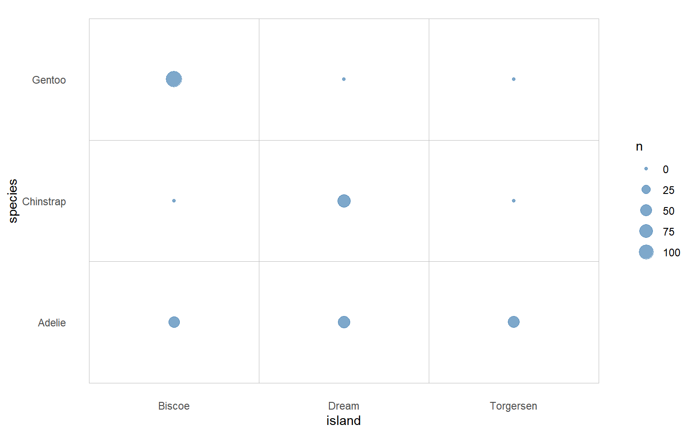
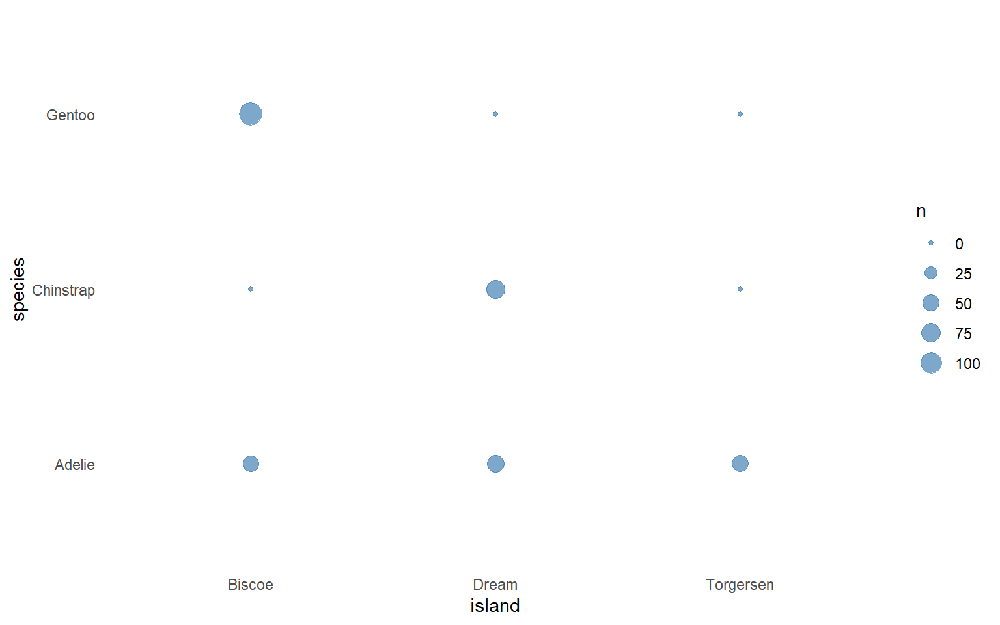
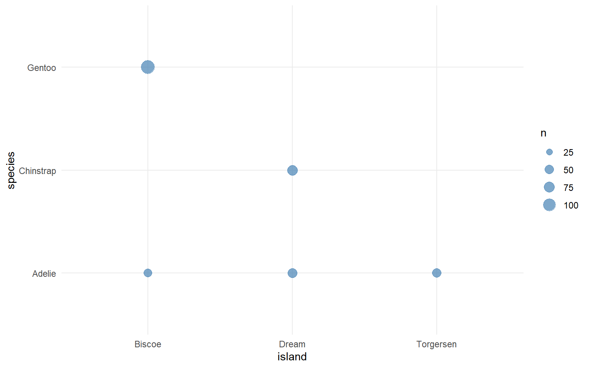

<details class="code-fold">
<summary>Code</summary>

``` r
library(ggplot2)
```

</details>
<details class="code-fold">
<summary>Code</summary>

``` r
head(penguins)
```

</details>

      species    island bill_len bill_dep flipper_len body_mass    sex year
    1  Adelie Torgersen     39.1     18.7         181      3750   male 2007
    2  Adelie Torgersen     39.5     17.4         186      3800 female 2007
    3  Adelie Torgersen     40.3     18.0         195      3250 female 2007
    4  Adelie Torgersen       NA       NA          NA        NA   <NA> 2007
    5  Adelie Torgersen     36.7     19.3         193      3450 female 2007
    6  Adelie Torgersen     39.3     20.6         190      3650   male 2007

<details class="code-fold">
<summary>Code</summary>

``` r
# Count penguins for each species / island
penguins_count <- penguins |>
  dplyr::count(species, island, .drop = FALSE)
penguins_count
```

</details>

        species    island   n
    1    Adelie    Biscoe  44
    2    Adelie     Dream  56
    3    Adelie Torgersen  52
    4 Chinstrap    Biscoe   0
    5 Chinstrap     Dream  68
    6 Chinstrap Torgersen   0
    7    Gentoo    Biscoe 124
    8    Gentoo     Dream   0
    9    Gentoo Torgersen   0

<details class="code-fold">
<summary>Code</summary>

``` r
p1 <- penguins_count |>
  ggplot(aes(x = island, y = species)) +
  geom_point(aes(size = n), color = "steelblue", alpha = 0.7) +
  theme_minimal()
p1
```

</details>


<details class="code-fold">
<summary>Code</summary>

``` r
p2 <- penguins_count |>
  ggplot(aes(x = island, y = species)) +
  geom_tile(fill = "white", color = "grey") +
  geom_point(aes(size = n), color = "steelblue", alpha = 0.7) +
  theme_minimal() +
  theme(
    panel.grid = element_blank()
  )
p2
```

</details>



<details class="code-fold">
<summary>Code</summary>

``` r
p1 + theme(panel.grid = element_blank())
```

</details>



<details class="code-fold">
<summary>Code</summary>

``` r
p1 + scale_size_area(limits = c(1, max(penguins_count$n)))
```

</details>

    Warning: Removed 4 rows containing missing values or values outside the scale range
    (`geom_point()`).


