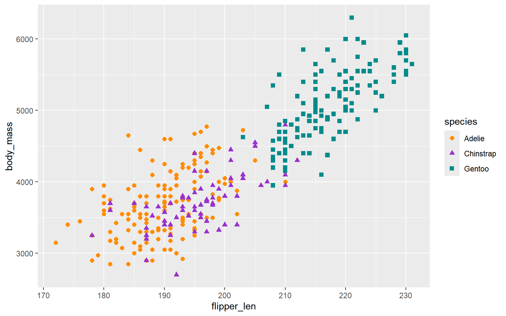
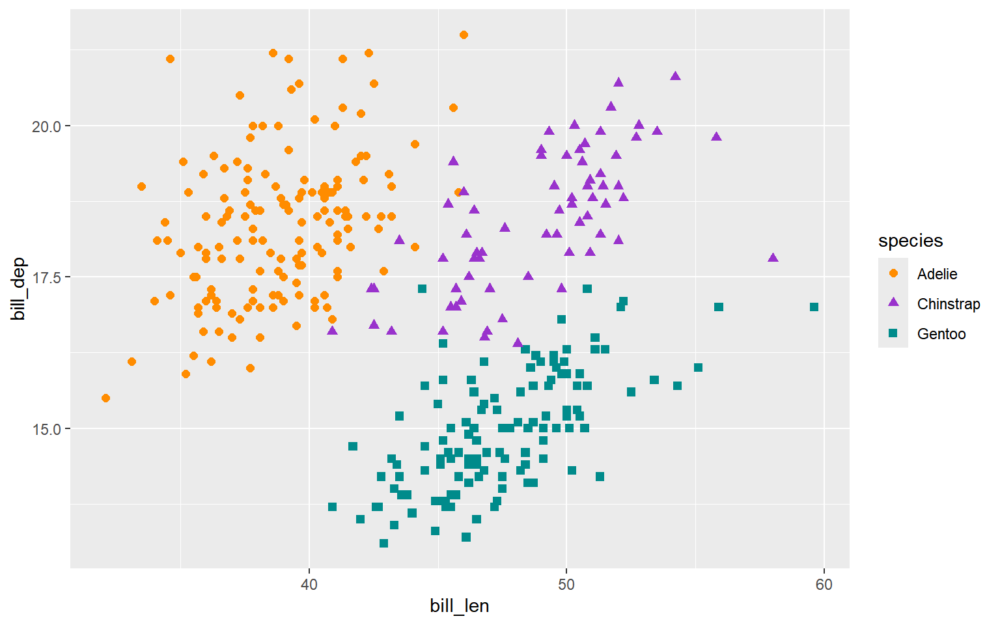

<details class="code-fold">
<summary>Code</summary>

``` r
library(ggplot2)
```

</details>
<details class="code-fold">
<summary>Code</summary>

``` r
# penguin flipper length versus body mass
penguins |>
  ggplot(aes(x = flipper_len, y = body_mass)) +
  geom_point(aes(color = species, 
                 shape = species),
             size = 2) +
  scale_color_manual(values = c("darkorange","darkorchid","cyan4")) 
```

</details>

    Warning: Removed 2 rows containing missing values or values outside the scale range
    (`geom_point()`).



<details class="code-fold">
<summary>Code</summary>

``` r
# penguin bill length versus bill depth
ggplot(data = penguins, aes(x = bill_len, y = bill_dep)) +
  geom_point(aes(color = species, 
                 shape = species),
             size = 2)  +
  scale_color_manual(values = c("darkorange","darkorchid","cyan4"))
```

</details>

    Warning: Removed 2 rows containing missing values or values outside the scale range
    (`geom_point()`).


